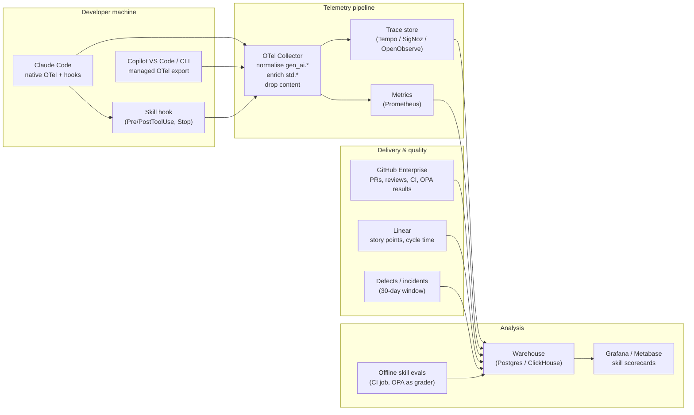

# Design Proposal: Telemetry and Metadata Capture for Standards-as-Skills

**Status:** Draft for review
**Date:** 2026-09-06
**Owner:** Chris (Solutions Architecture)
**Related:** Platform Standards Repo (skills + OPA/Rego), NFR context / ADR / PR-template chain, harness evaluation (Claude Code vs Copilot in VS Code)

---

## 1. Context

The platform standards repo already ships **skills** (generative layer: logging, log shipping, OTel conventions, HTTP client wrapper, etc.) coupled with **OPA/Rego policies** (deterministic layer: CI gates). What is missing is the **measurement layer**: we cannot currently say which skills are used, at what token cost, by which harness, and whether their use correlates with fewer policy failures, fewer review rounds, or fewer post-release defects. Without that, skill authoring is guided by intuition and skill sprawl goes unchecked.

This proposal defines how each skill invocation is captured as structured telemetry, joined to delivery and quality data, and fed back into a skill optimisation loop.

## 2. What the industry is doing (scan of the last ~8 weeks)

Summary of relevant developments, with the perspective each adds:

| Source | Development | Perspective for us |
|---|---|---|
| GitHub changelog, 8 Jul 2026 | Enterprise-managed OTel export for Copilot in VS Code and Copilot CLI: admins set endpoint, transport, resource attributes, headers and content-capture policy centrally; managed values override env vars. | Copilot and Claude Code can now feed **one collector** with the same governance posture. Content capture is a policy decision we control. |
| Claude Code docs (Jul–Sep 2026) | Native distributed tracing: `claude_code.interaction` → `llm_request` / `tool.execution` / `hook` child spans; `TRACEPARENT` propagation for SDK and `claude -p`; org analytics dashboard now reports skills adoption, MCP server usage, cost per PR/commit. | Skill invocations already appear as `tool.execution` spans for the Skill tool. Token attribution *after* a skill loads is the gap we must close ourselves. |
| anthropics/claude-code issue #35319 | Community request for native skill invocation analytics; notes that today's hook-based approach is fragile because hooks receive the tool call, not a first-class skill-name field. Lists the org-level questions it should answer (zero-invocation skills, single-user skills, high-invocation/low-success skills, adoption curve). | Validates the question set. We should design the schema so that if native support lands, our hook-derived data is a drop-in superset, not a rewrite. |
| OpenTelemetry GenAI semconv (repo moved Jun 2026; still *Development*, no tagged release as of Aug 2026) | Defines `invoke_agent`, `execute_tool`, MCP call spans, token-usage metrics and an evaluation-result event. Practitioner write-ups warn that SDKs disagree on ~6 attribute names and recommend normalising at the collector. | Adopt `gen_ai.*` names with version awareness. Put a **rename/normalise processor in the collector** so backend queries survive spec churn. Our custom attributes go in a separate namespace (`std.*`). |
| Arize/Phoenix, Braintrust, Langfuse guidance (Jun–Sep 2026) | Consistent message: observability records the run; **evaluation** applies criteria to that record. Start with one metric proving the agent completed the job, then add diagnostics (tool failures, retries, cost per successful task). Langfuse stresses that what the model *saw* (prompt version, skills, retrieved context) must be captured, since two runs diverge on context alone. | Skill **version** must be on every span. "Success" needs an objective definition: for standards-as-skills, the natural one is **policy-check outcome**. |
| Anthropic skill authoring guidance | "Evaluations are your source of truth"; no built-in eval runner, teams build their own. Recommends A/B: task with vs without the skill. | Offline evals per skill are needed alongside production telemetry. Our OPA/Rego policies are a ready-made, deterministic grader. |
| SkillAudit (arXiv, Jun 2026) and a data-driven analysis of ~40k public skills (Feb 2026) | Skill-centred assessment across utility, cost/efficiency and safety, measured across agent-model configurations; found heavy redundancy in public skill catalogues fragmenting adoption signals. | Reinforces per-skill, per-harness cost/utility scoring and a **deprecation policy** driven by data. |
| Third-party analytics (e.g. Larridin, OSS "skill-usage-tracker") | Session-level capture of which models/MCP servers/skills were used, metadata-only (names, counts, never content), joined to delivery outcomes via integrations. OSS hook-based trackers log skill start/end with duration and token deltas to local JSONL. | Confirms metadata-only capture is sufficient and audit-friendly. The OSS hook pattern is our short-term implementation. |

**Takeaway:** the ecosystem is converging on OTel GenAI conventions with collector-side normalisation, metadata-only capture, and evaluation joined to traces. Nothing off the shelf attributes tokens to a *skill* across two harnesses and joins that to quality outcomes; that is the piece we build.

## 3. Goals and non-goals

**Goals**

1. Every skill invocation produces a span carrying skill identity, version, harness, model, and token deltas.
2. Every span carries a **join key** (ticket ID) so telemetry can be correlated with story points, cycle time, PR review rounds, policy-check results and defects.
3. One pipeline serves Claude Code and Copilot (VS Code and CLI), with identical attribute names at the backend.
4. Metadata only: no prompt, response or file content leaves the developer machine.
5. Data supports a defined optimisation loop: keep / refine / merge / deprecate decisions per skill, per quarter.

**Non-goals**

- Proving developer productivity. Telemetry shows usage, cost and observed outcomes; correctness comes from tests, reviews and delivery data.
- Real-time alerting on skill behaviour (phase 2 candidate).
- Replacing the Claude Code org analytics dashboard or GitHub Copilot metrics API; we consume both as supplementary sources.

## 4. Design

### 4.1 Skill manifest metadata

Each `SKILL.md` gains structured front-matter that the telemetry layer reads and that the standards repo CI validates:

```yaml
---
name: structured-logging
version: 2.3.0            # semver, bumped by the standards repo release process
standard_id: STD-LOG-001  # links to the NFR/standards catalogue
policy_ids: [logging.required_fields, logging.no_pii]   # OPA/Rego packages this skill is coupled with
owner: platform-observability
harness_support: [claude-code, copilot-vscode, copilot-cli]
telemetry:
  emit: true
  success_signal: policy   # policy | test | manual
---
```

`standard_id` and `policy_ids` are the bridge between the generative and deterministic layers: they let us ask "when this skill was loaded, did the coupled policy pass on the resulting PR?"

### 4.2 Capture points



**Claude Code.** Native tracing provides the interaction/llm_request/tool.execution hierarchy. A `PreToolUse` hook matching the Skill tool parses the skill name and version from the tool input and writes `{session_id, skill, version, started_at}` to a per-session state file. A `PostToolUse` hook closes it. A `Stop` hook reads the transcript JSONL incrementally, sums `usage` for llm_requests between skill start and the end of the turn, and emits one **`std.skill.invocation`** span per skill with the attributes in §4.3. Subagent-based skills additionally get a clean subtree via `TRACEPARENT`.

**Copilot.** Managed OTel export delivers model-call and tool-execution spans. Skills surface as tool calls with `gen_ai.tool.name`; the collector maps those to `std.skill.*` using a lookup table maintained in the standards repo (skill name → `standard_id`, `version` from the installed catalogue commit). Token attribution uses the same "requests between skill invocation and turn end" rule, computed in a collector `transform` processor or a small post-processing job. Copilot's per-turn granularity is coarser than Claude Code's; this is recorded as a known limitation in the comparison.

**Join key enrichment.** A `SessionStart` (Claude) / workspace task (Copilot) captures `git branch` and parses the ticket ID into `OTEL_RESOURCE_ATTRIBUTES` (`std.ticket.id`, `std.repo`, `std.team`). Where a branch has no ticket, the value is `unattributed` and the session is excluded from outcome analysis but retained for cost analysis.

### 4.3 Span and metric schema

Namespace: `gen_ai.*` as emitted (normalised at the collector), `std.*` for our additions.

| Attribute | Source | Notes |
|---|---|---|
| `gen_ai.usage.input_tokens`, `output_tokens`, `cache_read_input_tokens`, `cache_creation_input_tokens` | harness | cache split kept separate; dominates harness cost differences |
| `gen_ai.request.model`, `gen_ai.provider.name` | harness | |
| `std.harness` | resource | `claude-code`, `copilot-vscode`, `copilot-cli` |
| `std.harness.mode` | resource/span | `chat`, `agent`, `plan`, `headless` |
| `std.skill.name`, `std.skill.version`, `std.standard_id` | hook / lookup | |
| `std.skill.trigger` | hook | `auto` (model-selected), `explicit` (slash command), `subagent` |
| `std.skill.load_tokens` | hook | tokens attributable to loading SKILL.md and referenced files |
| `std.skill.tail_tokens` | derived | tokens consumed in the turn after the skill loaded |
| `std.mcp.server`, `gen_ai.tool.name` | harness | for MCP-backed skills |
| `std.ticket.id`, `std.repo`, `std.team` | resource | join keys |
| `std.policy.ids` | manifest | coupled OPA packages |

Derived metrics (collector `spanmetrics` + warehouse):

- `std_skill_invocations_total{skill, version, harness, trigger}`
- `std_skill_tokens_total{skill, version, harness, type}`
- `std_skill_duration_seconds` histogram
- `std_skill_error_total` (tool.execution status ERROR while skill active)

### 4.4 Outcome and quality signals

Joined at ticket and PR level in the warehouse:

| Signal | Source | Use |
|---|---|---|
| OPA/Rego result per `policy_id` on the PR | GitHub Actions check output (JSON artefact) | **Primary success signal** for standards-as-skills: did the coupled policy pass first time? |
| Review rounds, time-to-first-approval | GitHub API | Rework proxy |
| CI failures per PR | GitHub Actions | |
| Story points, cycle time, lead time | Linear | Normalised within team |
| Defects linked to ticket within 30 days; incident references | Linear / incident tooling | Lagging quality |
| PR labelled `claude-code-assisted` / Copilot equivalent | Claude Code org analytics, Copilot metrics API | Cross-check for coverage |

### 4.5 Skill scorecard

Per skill, per version, per harness, computed weekly:

- **Adoption:** invocations, distinct users, share of eligible sessions (sessions in repos where the skill's `standard_id` applies).
- **Cost:** median load tokens, median tail tokens, cost per invocation, cost per policy-passing PR.
- **Effectiveness:** first-time policy pass rate with skill vs without (same repo, same policy, same period); review rounds with vs without.
- **Reliability:** tool error rate while active; abandonment (skill loaded, turn ended without an edit).
- **Redundancy:** overlap index against other skills (co-invocation frequency and shared `policy_ids`).

Thresholds drive a quarterly action: **keep**, **refine** (high cost or low first-time pass), **merge** (high overlap), **deprecate** (zero invocations in 90 days or single-user).

### 4.6 Offline evaluation

A CI job in the standards repo runs each skill against a fixed task set in both harnesses (headless `claude -p` and Copilot CLI), applies the coupled OPA policies to the output, and records pass rate and tokens under `std.eval.*` spans with the same schema. This gives a controlled baseline per version and catches regressions before rollout; production telemetry then shows whether the baseline holds in real use.

### 4.7 Privacy, compliance and governance

- Content capture disabled at both harnesses via managed settings; collector additionally drops any `gen_ai.input.*`/`gen_ai.output.*` events as defence in depth.
- Developer identity pseudonymised at the collector (`std.user.hash`); team-level reporting by default, individual-level only with consent for the crossover study.
- Bearer tokens for collector auth issued from Vault with rotation; collector runs on OpenShift with the standard platform observability stack.
- Schema and attribute versioning tracked as an ADR; a collector-side rename map handles upstream `gen_ai.*` changes so dashboards do not break.

## 5. Implementation plan

| Phase | Scope | Exit criteria |
|---|---|---|
| 0 — Baseline (2 wks) | Collector deployed; Claude Code native OTel and Copilot managed export flowing; Grafana cost dashboard by harness/model | Both harnesses visible, cache split correct |
| 1 — Skill spans (3 wks) | Hooks + manifest front-matter; `std.skill.*` spans for Claude Code; Copilot lookup mapping; ticket-ID enrichment | ≥90% of sessions carry `std.ticket.id`; skill invocations match dashboard counts ±5% |
| 2 — Outcome join (3 wks) | OPA results exported as artefacts; GitHub/Linear ingestion to warehouse; first scorecards | Scorecard for top 10 skills with first-time pass rate |
| 3 — Evaluation study (1 sprint × 2) | Crossover Claude Code vs Copilot; skill on/off A/B on comparable tickets | Decision memo on harness and skill actions |
| 4 — Loop (ongoing) | Quarterly keep/refine/merge/deprecate review; offline evals gate skill releases | First deprecation and first refined skill shipped with measured improvement |

## 6. Risks and mitigations

| Risk | Mitigation |
|---|---|
| Hook-based skill detection is fragile (no first-class skill field) | Isolate parsing in one script with tests; watch for native support and keep schema drop-in compatible |
| Token attribution "tail" rule over-attributes when several skills load in one turn | Split tail proportionally by load order; report first-skill-only as a sensitivity check |
| Copilot granularity coarser than Claude Code | Report per-turn for both in comparisons; use Claude Code's finer data only for within-harness tuning |
| GenAI semconv churn | Collector rename map; pin to schema version in ADR |
| Story points as denominator distort cross-team comparison | Normalise within team; primary ratios are per merged PR and per policy-passing PR |
| Small samples in early sprints | Report confidence intervals; defer harness decision until minimum N per arm |

## 7. Decisions requested

1. Approve `std.*` namespace and manifest front-matter as the standards-repo contract.
2. Approve OPA first-time pass rate as the primary effectiveness metric for standards-as-skills.
3. Confirm trace backend (extend existing platform stack vs SigNoz/OpenObserve) and warehouse target.
4. Confirm consent model for individual-level attribution during the crossover study.
